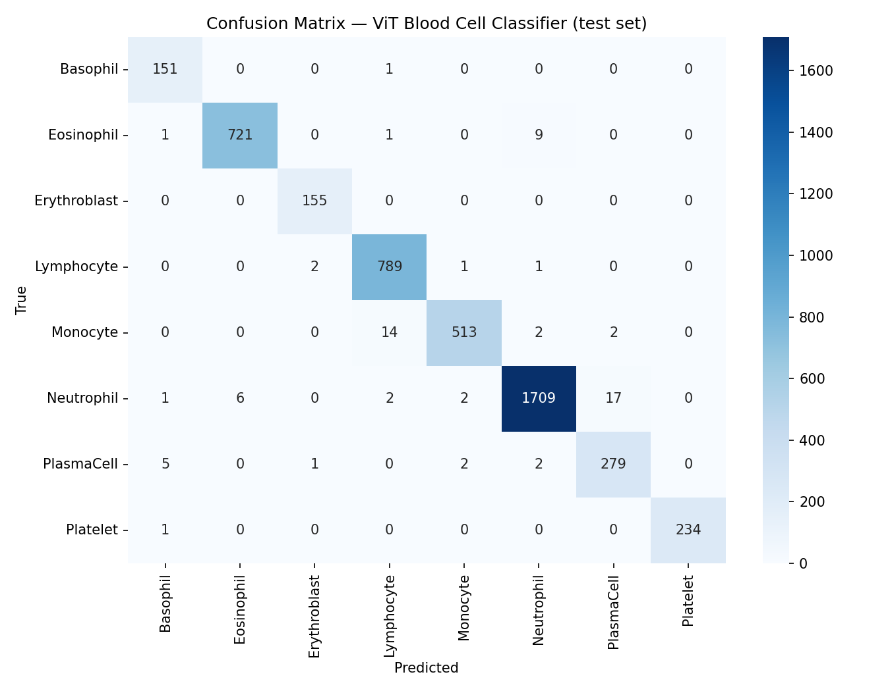

# ViT Biomedical Fine-Tuning — Blood Cell Classification

Fine-tuning `google/vit-base-patch16-224` (Vision Transformer) to classify
peripheral blood cell microscopy images into 8 classes, using the Hugging
Face `transformers` `Trainer` API. Trained on a free Colab T4 GPU.


---

## Overview

| | |
|---|---|
| **Task** | Multi-class image classification (8 classes) |
| **Base model** | [`google/vit-base-patch16-224`](https://huggingface.co/google/vit-base-patch16-224) |
| **Dataset** | [`ehottl/blood_dataset`](https://huggingface.co/datasets/ehottl/blood_dataset) — 46,232 microscopy images |
| **Classes** | basophil, eosinophil, erythroblast, lymphocyte, monocyte, neutrophil, plasma cell, platelet |
| **Framework** | 🤗 `transformers` `Trainer`, `datasets`, `evaluate` |
| **Hardware** | Google Colab, free-tier T4 GPU |
| **Demo** | Gradio (local or Hugging Face Spaces) |

## Results

Evaluated on the held-out test split (4,624 images, stratified from the full
46,232-image dataset).

| Metric | Value |
|---|---|
| Test accuracy | **98.42%** |
| Test macro F1 | **98.13%** |
| Training time (T4, 4 epochs) | _TBD — fill in from your Trainer logs_ |

**Per-class breakdown:**

| Class | Support | Precision | Recall | F1 |
|---|---:|---:|---:|---:|
| Basophil | 152 | 0.950 | 0.993 | 0.971 |
| Eosinophil | 732 | 0.992 | 0.985 | 0.988 |
| Erythroblast | 155 | 0.981 | 1.000 | 0.990 |
| Lymphocyte | 793 | 0.978 | 0.995 | 0.986 |
| Monocyte | 531 | 0.990 | 0.966 | 0.978 |
| Neutrophil | 1,737 | 0.992 | 0.984 | 0.988 |
| Plasma cell | 289 | 0.936 | 0.965 | 0.951 |
| Platelet | 235 | 1.000 | 0.996 | 0.998 |

Plasma cell is the weakest class (precision 0.936) — it's most often confused
with neutrophil and basophil, which makes sense given morphological overlap
under the microscope at this resolution. Basophil is the rarest class
(support 152) and still hits 97%+ F1, suggesting the augmentation strategy
handled the class imbalance reasonably well.



## Project structure

```
vit-biomedical-finetuning/
├── README.md
├── requirements.txt
├── notebooks/
│   └── 01_finetune_vit.ipynb      # Main Colab notebook — data, training, eval
├── app/
│   └── gradio_demo.py             # Inference-only demo, deployable to HF Spaces
├── configs/
│   └── config.yaml                # All hyperparameters live here
└── results/                       # Saved model checkpoint, confusion matrix, screenshots
    └── .gitkeep
```

## How it works

1. **Data** — loads `ehottl/blood_dataset` from the Hub and creates a
   stratified 80/10/10 train/validation/test split (the dataset only ships
   a single split).
2. **Preprocessing** — `ViTImageProcessor` supplies the normalization
   stats; `torchvision` transforms handle resizing/augmentation (random
   crop, flip, rotation for train; deterministic resize/center-crop for
   eval).
3. **Model** — `ViTForImageClassification` loaded from the ImageNet-21k/1k
   pretrained checkpoint, with the classification head replaced for 8
   classes.
4. **Training** — `Trainer` with mixed precision (`fp16`), tuned for a
   16GB T4: batch size 32, 4 epochs, `2e-5` learning rate.
5. **Evaluation** — accuracy, macro F1 (robust to class imbalance),
   per-class precision/recall/F1, and a confusion matrix.
6. **Demo** — a Gradio app (`app/gradio_demo.py`) for interactive
   inference, loadable locally or on a Hugging Face Space.

All hyperparameters are centralized in `configs/config.yaml` rather than
hardcoded in the notebook, so a run is reproducible by editing one file.

## Getting started

### Option A — Google Colab (recommended)

1. Open `notebooks/01_finetune_vit.ipynb` in Colab (Runtime → Change
   runtime type → **T4 GPU**).
2. Run all cells top to bottom. The first cell can optionally `git clone`
   this repo so `configs/config.yaml` and `results/` resolve correctly.
3. Trained model checkpoint, metrics, and plots are saved to `results/`.

### Option B — Local / any environment with a GPU

```bash
git clone https://github.com/PRaruj/vit-biomedical-finetuning.git
cd vit-biomedical-finetuning
pip install -r requirements.txt
jupyter notebook notebooks/01_finetune_vit.ipynb
```

### Run the Gradio demo

```bash
# after training, so results/vit-blood-cell-classifier exists
python app/gradio_demo.py
```

Or push the fine-tuned model to the Hugging Face Hub (`hub.push_to_hub:
true` and `hub.repo_id` in `configs/config.yaml`) and deploy `app/gradio_demo.py`
directly as a Hugging Face Space.

## Notes on scope

This is a portfolio/learning project demonstrating an end-to-end fine-tuning
pipeline with the Hugging Face ecosystem — **not** a validated diagnostic or
clinical tool. Blood cell classification from microscopy images is a
real research area (e.g. for automating parts of the CBC differential),
but any real-world use would require a much larger, clinically validated
dataset and regulatory review.

## License

MIT — see [LICENSE](LICENSE).

## Author

Built by [Praruj Thapa](https://prarujthapa.com.np) —
[GitHub](https://github.com/PRaruj) ·
[LinkedIn](https://www.linkedin.com/in/praruj-thapa)
